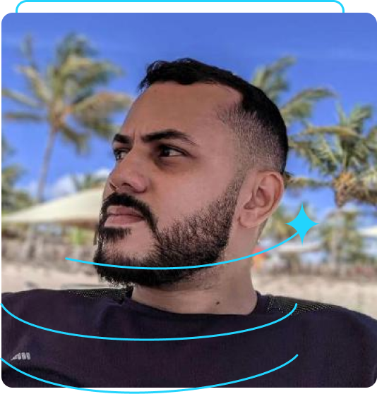

# Portfolio HTML and CSS

Este é um exemplo de um README.md para um projeto simples de portfolio criado com HTML e CSS. O projeto é dedicado ao curso de HTML e CSS da Alura e é uma ótima maneira de compartilhar sua jornada como iniciante na programação.

## Conteúdo

- [Visão Geral](#visão-geral)
- [Pré-requisitos](#pré-requisitos)
- [Instruções de Uso](#instruções-de-uso)
- [Estrutura do Projeto](#estrutura-do-projeto)
- [Recursos Utilizados](#recursos-utilizados)
- [Contribuições](#contribuições)
- [Licença](#licença)

## Visão Geral

Este é um simples projeto de portfolio criado com HTML e CSS, dedicado ao curso de HTML e CSS da Alura. Ele inclui informações pessoais, uma breve descrição e links para redes sociais e perfis de desenvolvedor.



### Pré-requisitos

Antes de começar, você deve ter o seguinte instalado em sua máquina:

- Navegador da web moderno

## Instruções de Uso

1. Clone este repositório em seu ambiente de desenvolvimento:

   ```bash
   git clone https://github.com/seu-usuario/portfolio-html-css-alura.git
   ```

2. Abra o arquivo `index.html` em seu navegador ou, se preferir, inicie um servidor local para visualizar o projeto.

## Estrutura do Projeto

A estrutura do projeto é simples:

- `index.html`: Contém a estrutura HTML do portfolio.
- `style.css`: O arquivo CSS responsável pela estilização do portfolio.
- `imagens/`: Pasta que contém a imagem de perfil.

## Recursos Utilizados

Este projeto utiliza os seguintes recursos:

- Fontes do Google Fonts: "Krona One" e "Montserrat".
- Cores personalizadas.
- Flexbox para o layout.

## Contribuições

Contribuições são bem-vindas! Se você encontrar algum problema ou tiver sugestões de melhorias, sinta-se à vontade para abrir uma [issue](https://github.com/seu-usuario/portfolio-html-css-alura/issues) ou enviar um [pull request](https://github.com/seu-usuario/portfolio-html-css-alura/pulls).

## Licença

Este projeto está sob a licença [MIT](LICENSE). Sinta-se à vontade para usá-lo conforme necessário.
